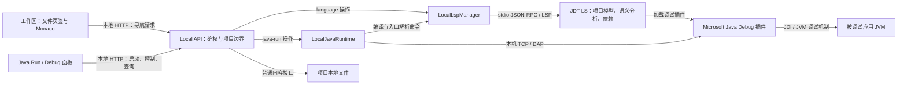
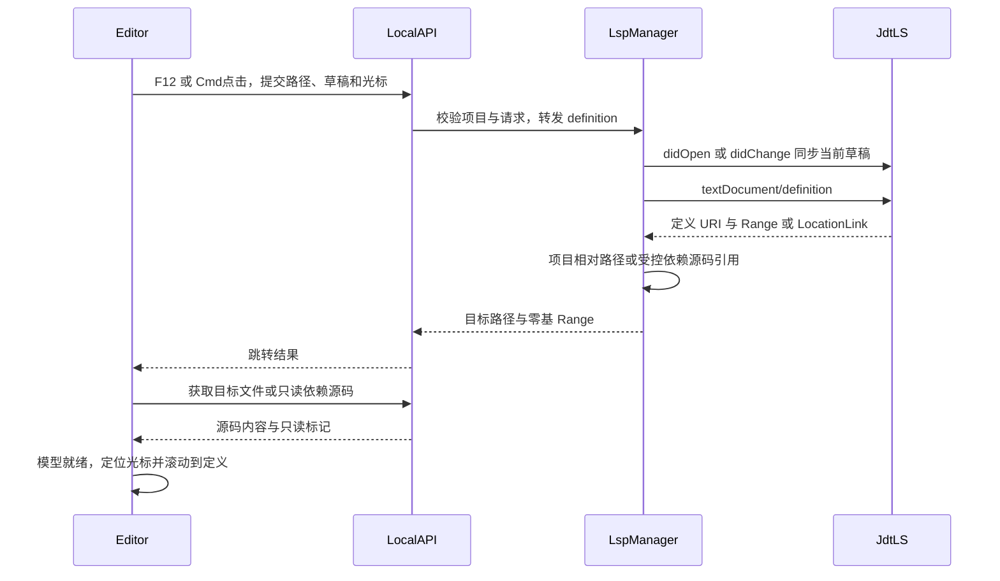
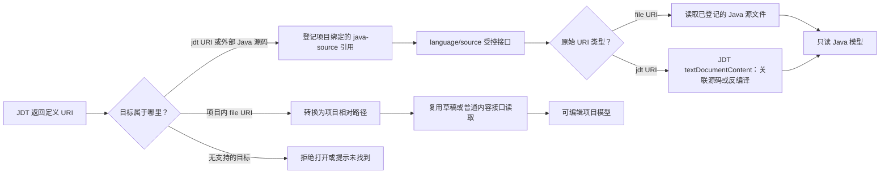
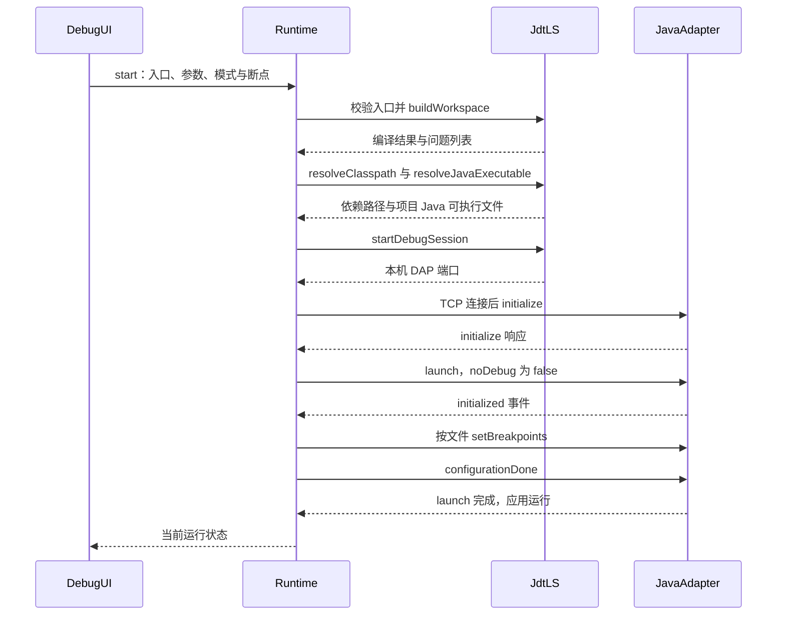
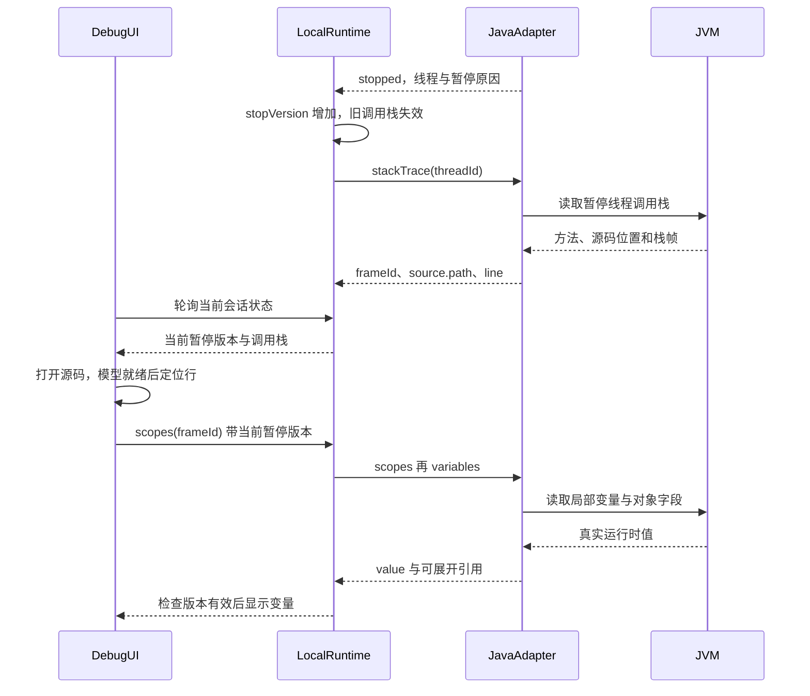
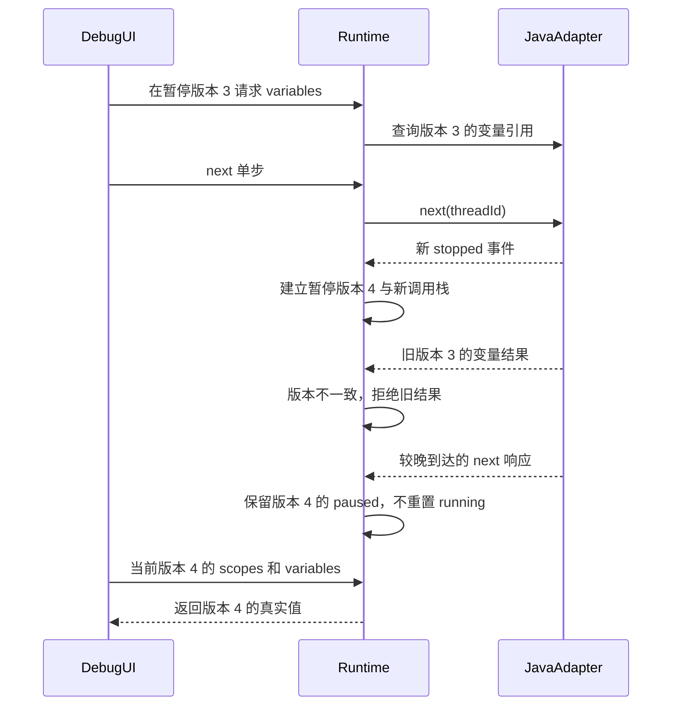

# 代码编辑器：检索、代码导航与桌面 Java Debug

本文前半部分说明网页版的浏览器索引与远程 LSP 控制面；后半部分说明已经实现的桌面 Local API / LSP / Java DAP 链路。两者复用 Monaco 和交互约定，但运行实例、路径边界和权限模型不同，不能把网页版“尚未启动 LSP Worker”的限制套用到桌面版。

阅读建议：先看文末的[原理详解与交互图](#原理详解与交互图)，再回到接口、实现入口和排障部分。图中的架构和示例以当前桌面代码为准；示例类名、帧号及变量引用是解释用数据，不是固定协议值。

## 目标与当前能力

在线编辑器以“用户工作区 + Git 分支”为数据边界。浏览器只会索引当前会话对应工作区中的源码，因此不同用户、不同分支之间不会共享文件内容或 Monaco 模型。

当前提供以下能力：

- 文件名与源码正文的全局字面量搜索，入口位于文件树上方，快捷键为 `Cmd/Ctrl+Shift+F`；正文结果可直接定位到行、列。
- TypeScript/JavaScript 项目级 Monaco 模型同步，使相对路径导入、变量定义跳转和引用查找能够跨文件工作。
- 已打开文件的未保存草稿优先进入语言服务，避免代码导航仍指向旧磁盘内容。
- 当前文档及其他已索引文档参与单词补全。

## API 与权限边界

| API | 用途 | 权限 |
| --- | --- | --- |
| `GET /sessions/:id/files/index` | 返回受限源码模型供浏览器语言服务使用 | 登录 + `project:read` + 会话/项目访问校验 |
| `GET /sessions/:id/files/search?query=...` | 搜索文件路径和源码正文 | 登录 + `project:read` + 会话/项目访问校验 |

两个接口都通过会话解析用户工作区，不接受客户端传入物理目录。路径继续经过工作区路径和符号链接校验。

为避免大仓库拖垮 API 或浏览器，源码索引限制为单文件 256 KiB、总计 4 MiB、最多 300 个模型；全文搜索最多扫描 10 MiB，并最多返回 200 条结果。依赖目录、构建产物、Git 元数据、隐藏文件和二进制文件不参与扫描。达到边界时接口返回 `truncated: true`，界面提示缩小关键词。

## 已知边界

Monaco 浏览器内置语言服务当前只对 TypeScript/JavaScript 提供可靠的语义级跨文件跳转。Java、Go、Python、Rust 等语言目前仍以语法高亮、全文搜索和基于文本的补全为主，不等价于 IDE 的语言服务器能力。

大仓库、依赖符号、路径别名以及生成代码可能因索引上限或缺少依赖类型声明而无法跳转。当前关闭 TS/JS 语义诊断是为了避免未安装依赖类型时产生大量误报，但这也意味着编辑器不会展示完整的类型错误。

## 后续演进

### 已完成：通用控制面

API 已提供语言服务会话控制面：

- `POST /sessions/:sessionId/lsp/sessions` 创建语言服务会话并签发 256 bit 短期一次性票据。
- `GET /sessions/:sessionId/lsp/sessions/:id` 查询当前用户自己的会话状态。
- `DELETE /sessions/:sessionId/lsp/sessions/:id` 关闭当前用户自己的会话。
- Redis 保存短期会话和路由元数据，API Pod 不持有本地会话状态，可进行多副本部署。
- 工作区键由租户、用户、项目和分支生成；服务端记录真实工作区路径，但不会返回给浏览器。
- 原始连接票据不落库、不写 Redis，只保存 SHA-256 摘要，并通过原子 `GETDEL` 保证只能消费一次。
- 票据不放入 WebSocket URL，避免被 Ingress、代理和访问日志记录；后续客户端应在连接后的首条认证消息中提交票据。

功能开关 `LSP_ENABLED` 默认关闭。在 LSP Worker 和 WebSocket 数据面接入前不得在生产环境开启。票据默认 60 秒过期，会话默认 30 分钟过期，均可通过 Helm 配置调整。

### 后续步骤

部署阶段建议引入独立、限额的语言服务 Worker，而不是在 API Pod 中常驻语言服务器：

1. 按“用户 + 项目 + 分支”创建语言服务实例和缓存键。
2. Java 接入 JDT LS，Python 接入 Pyright，Go 接入 gopls，Rust 接入 rust-analyzer。
3. 通过 WebSocket 转发 LSP，并对实例设置空闲回收、CPU/内存和最大工作区限制。
4. 依赖索引缓存只能复用公共依赖元数据，用户源码索引不得跨工作区共享。
5. 搜索规模增大后改为异步增量索引；索引事件携带工作区版本，保存和切换分支时失效。

以上属于部署期能力，当前实现不要求启动语言服务进程。

## 桌面实现：职责划分与源码入口

桌面版直接使用本机项目目录，不依赖远程 API、Redis、BullMQ 或 Worker。Monaco 是编辑器和交互层，语义解析由本机语言服务器完成；Java Debug 使用独立的 DAP 连接，不通过 LSP 模拟调试。

| 组件 | 实现位置 | 职责 |
| --- | --- | --- |
| 工作区与文件编辑器 | `apps/web/src/components/Desktop/DesktopLocalWorkspace.tsx` | 多文件、F12 / Cmd/Ctrl+点击、导航历史、断点装饰、行定位 |
| Monaco 语言桥接 | `apps/web/src/lib/monaco.ts` | 按项目注册 Provider，转换 URI、位置、Location/LocationLink |
| 本地接口与安全检查 | `apps/desktop/src/local-api.cjs` | 校验启动令牌、Origin、项目 ID，转发受控 LSP / Debug 操作 |
| LSP 生命周期与 Java 源码引用 | `apps/desktop/src/local-lsp-manager.cjs` | 语言进程、文档同步、诊断、编译、依赖源码、空闲回收 |
| Java 运行和调试 | `apps/desktop/src/local-java-runtime.cjs` | main 入口、编译、DAP TCP 连接、调用栈、变量、单步、停止 |
| Debug 界面 | `apps/web/src/components/Desktop/DesktopJavaRun.tsx` | 启动配置、轮询、调用帧选择、变量树、错误列表 |
| 语言组件交付 | `apps/desktop/scripts/install-jdtls.cjs`、`install-java-tools.cjs` | 固定版本、下载/缓存、SHA-256 校验、打包资源 |

### 1. 项目与文档标识

前端模型使用 `codegen://<projectId>/<逐段编码的相对路径>`，例如 `codegen://<projectId>/src/main/java/sample/Main.java`。模型的 authority 是项目 ID；Provider 会检查 authority，避免一个项目的请求被另一个已打开项目处理。

Local API 不接受前端任意指定的物理工作区。它用已登记的项目 ID 解析目录；LSP Manager 用 `realpath` 校验源码文件是否位于该目录内，然后转换为语言服务器认识的 `file:` URI。请求里的 `line` / `column` 和 Monaco 一样从 1 开始，发给 LSP 时减 1；LSP Range 返回界面时加 1。DAP 初始化则声明行列从 1 开始，不能再对 DAP 行号做一次加 1。

语言服务实例按 `projectId:provider` 复用。项目打开时后台预热；Java 初始化包括根目录、workspaceFolders、客户端能力和配置，等待初始化/就绪通知。TypeScript/JavaScript、Pyright、JDT LS 是首批内置链路；Vue 已随桌面包交付，clangd、gopls、rust-analyzer 需要本机对应程序。常规空闲回收时间为 10 分钟；Java 运行/调试持有 LSP lease，避免程序运行期间被空闲清理。

### 2. 一次定义跳转如何完成

1. 用户按 F12 或 Cmd/Ctrl+点击符号。工作区拿到当前模型、光标位置和未保存文本；Provider 也为定义、声明、类型、实现、引用等提供同一套桥接。
2. 前端发送 `POST /api/local/projects/:id/language/definition`，请求包括相对 `path`、`content`、1-based `line` 和 `column`。
3. LSP Manager 选定语言服务器；首次发送 `textDocument/didOpen`，内容变化时发送带递增版本的 `textDocument/didChange`。因此查询使用当前草稿，不要求先保存。
4. 发出 `textDocument/definition`。Java 冷启动返回空数组时，等待 250ms 重试一次；仍为空才按光标标识符调用 `workspace/symbol`，匹配项目内同名符号。这个回退不是完整语义消歧，不保证所有重载或同名类都能正确选择。
5. 返回值可能是 Location，也可能是 LocationLink。后端将 `uri` / `targetUri` 归一化为项目相对路径；前端兼容 `range`、`targetSelectionRange`、`targetRange`，转换成 Monaco Location。
6. 工作区通过 `openFile` 打开目标，记录导航历史，再设置光标并居中显示。已有文件草稿、文件页签和 Monaco 模型继续复用；项目菜单切换通过保留工作区实例避免重新加载全部索引。

悬浮能显示签名，不代表定义已经成功打开：`textDocument/hover` 和 `textDocument/definition` 是不同请求。曾出现的“有签名但跳转无反应”，涉及 LocationLink 转换、Java 冷启动空结果、以及 JAR/JDK 外部 URI 被当成越界路径丢弃，分别在上述链路中修正。

保存磁盘内容后，Local API 通知已有语言服务 `didSave` 和 `workspace/didChangeWatchedFiles`，让后续诊断、跳转和编译反映最新文件。LSP 暂不可用不会撤销已经成功的磁盘保存。

### 3. JAR、JDK 及项目外依赖源码如何打开

普通内容接口仍然不允许任意读取工作区外文件。依赖源码使用单独的受控引用机制：

1. JDT LS 的跳转结果可能是 `jdt:` 类文件 URI，或语言服务返回的外部 `.java` 文件 URI。
2. Manager 为该结果登记 `projectId + @java-source/<URI 摘要>/<Class.java>`，内部保存原始 URI。前端只得到虚拟路径和只读标记，不能指定任意外部文件。
3. 工作区对虚拟路径调用 `GET /api/local/projects/:id/language/source?path=...`，而不是普通 `/content`。
4. 如果是已登记的 `.java` 文件，读取对应源码；如果是 `jdt:` URI，调用 `workspace/textDocumentContent`。仅在服务端不支持该方法时，回退到 `java/classFileContents`。
5. 有关联 source attachment 时，JDT 提供原始源码；无源码包时由 JDT 的类文件内容/反编译能力返回实现。当前交付的 JDT 包含反编译引擎，不只是方法签名占位。
6. 返回 `text/x-java-source`、内容摘要和 `readOnly: true`，最大 2 MiB。编辑器和保存函数都拒绝写入；在依赖源码上继续查询时，Manager 用已登记的原 URI 发给 JDT。

引用绑定当前项目；跨项目、伪造或客户端重启后失效的引用必须从定义跳转重新取得。JDK `String` 与无源码包的自建 JAR 已有真实集成测试。反编译内容不是原始源文件，行号可能与原始调试行表不同，不能把“可以阅读反编译实现”等同于“所有依赖都可以精确源码调试”。

### 4. Lombok 与 Java 编译

Java 语言服务使用 `-javaagent:<bundled lombok.jar>` 启动。否则 JDT 看不到 Lombok 生成的 getter、setter、日志字段等，即使 Maven 编译正常，编辑器仍可能误报。当前客户端资源为 JDT LS 1.61.0、Lombok 1.18.38、Microsoft Java Debug 插件 0.53.2；插件路径通过 `initialize.initializationOptions.bundles` 交给 JDT。客户端不依赖用户安装 VS Code；安装脚本可以利用本机缓存，但最终构建会包含自己的工具副本和许可证。

本机仍须有适合语言服务和项目的 JDK，以及项目声明的 Lombok/其他依赖。当前 JDT 配置启用 Maven 导入，Gradle 导入未启用；不能把已支持的 Gradle Spring Boot 预览命令误认为 Gradle DAP 已完成验收。

运行前用 `vscode.java.buildWorkspace` 编译，传入入口的 `mainClass`、`projectName` 和 `isFullBuild`。每个 Runtime 的项目首次成功运行前做完整重建，清理启用 Lombok 前缓存的旧错误；后续成功运行使用增量编译。命令状态区分成功、编译有错、取消和失败。失败时收集项目内诊断和构建消息，返回文件、行列、错误文本，运行面板可点击跳转；不允许忽略真实错误后启动旧 class 文件。

未保存修改时，界面提示先保存。`diagnose-java-build.cjs` 可在临时目录构建只读源码快照，不修改原项目，也不运行应用；已用 `fx-server` 快照验证完整编译成功。

## 桌面实现：Java Run / Debug

### 1. 启动配置与协议分工

入口列表由 JDT 插件的 `vscode.java.resolveMainClass` 返回，包含 mainClass 和 projectName。前端选择后提交程序参数和 JVM 参数；后端再次核对入口属于检测结果，不接受任意未经验证的 mainClass。

| 阶段 | 命令或协议 | 结果 |
| --- | --- | --- |
| 检测入口 | LSP `workspace/executeCommand` → `vscode.java.resolveMainClass` | 可运行的 Java main 配置 |
| 编译 | `vscode.java.buildWorkspace` | 状态、编译错误 |
| 解析依赖 | `vscode.java.resolveClasspath` | modulePaths、classPaths |
| 解析 JDK | `vscode.java.resolveJavaExecutable` | 当前项目 Java 可执行文件 |
| 创建调试服务 | `vscode.java.startDebugSession` | 本机 DAP 端口 |
| 调试交互 | 独立 TCP DAP | 断点、线程、调用栈、作用域、变量、控制命令 |

LocalJavaRuntime 只连接 `127.0.0.1` 的有效端口。DAP 消息通过 `Content-Length` 头和 JSON body 分帧，按 `request_seq` 匹配响应；支持 TCP 分片/多帧，单缓冲限制为 8 MiB，请求超时 60 秒。原始 socket 和任意 DAP 命令不暴露给渲染层。

渲染层使用的本地路由前缀为 `/api/local/projects/:id/java-run`：`GET /targets` 获取入口，`GET` 获取会话状态，`POST /start` 启动；`POST /stop`、`/pause`、`/continue`、`/next`、`/stepIn`、`/stepOut` 控制执行；`POST /breakpoints` 更新断点；`POST /scopes`、`/variables` 读取当前暂停值。后两者携带会话/暂停标识以防旧引用被继续使用。这些接口仍需启动令牌或受保护 Cookie，并接受项目边界和企业策略校验。

### 2. Debug 启动的顺序

1. 检查同项目没有活动运行会话，持有 Java LSP lease，校验入口并完成编译。
2. 解析 classpath / modulepath / Java executable，再连接 DAP 服务。
3. 发 `initialize`，声明路径格式为原生 path、行列为 1-based，使用内部控制台而不是外部终端。
4. 发 `launch`，包含入口、项目、cwd、依赖、JDK、程序/JVM 参数。Run 模式用 `noDebug: true`；Debug 用 `noDebug: false`。
5. Debug 等待 `initialized` 事件，然后按文件发送 `setBreakpoints`，最后发送 `configurationDone`，等待 launch 完成。
6. 输出通过 `output` 事件进入运行日志；`terminated`、连接关闭或主动 `disconnect(terminateDebuggee: true)` 更新结束状态并释放 lease。

断点只允许当前工作区真实存在的 Java 文件，行号和数量有限制。点击 Monaco glyph margin 设置/取消断点，后端返回 verified / message；未绑定断点会显示原因。Run 与 Debug 都由 Local API 直接执行，不会创建远程 Worker 任务。企业终端禁用策略也会阻止本地 Java 运行和调试。

### 3. 暂停、单步与自动定位

`stopped` 事件并不直接包含完整源码位置。后端先记录暂停线程；若事件未提供 threadId，再请求 `threads`。随后发送 `stackTrace`，得到 frame id、源码路径、行列。路径经过 `file:` URI 解码、`realpath` 和工作区边界检查；普通原生路径、带空格 URI 和 macOS 的实际路径/别名均统一成项目相对路径。项目外调用帧保留名称，但目前不通过 Debug 接口任意读取外部源码。

每次启动有独立 `sessionId`，每次 `stopped` 递增 `stopVersion`。异步调用栈响应只有在对应暂停仍有效时才写入；继续/单步后到达的旧响应不能覆盖新栈。尤其是调试器先发送下一次 `stopped`、后回复 `next` 的情况，控制命令不能把新的暂停状态重置为 running。

前端在项目活动时以 700ms 轮询状态；不并发堆积请求，执行操作期间暂停普通轮询，旧请求不能覆盖操作结果。暂停后优先选中第一个可定位的项目源码调用帧；用户也可以选择其他调用帧。定位键包含 sessionId、stopVersion、frame id、路径和行列，重复命中同一行也会重新定位。切出项目不消费后台定位，切回来仍会定位到有效暂停帧。

源码打开后，不立即在旧 editor 上清除定位目标。需要等目标文件已加载、Monaco 模型与当前路径一致、模型未 dispose、编辑器 DOM 已挂载，再调用 `setPosition`、`revealPositionInCenter` 和 focus。当前执行行以 decoration 标记；手动选择调用帧时，源码定位和变量面板使用同一个当前帧。

### 4. 变量值与对象展开

变量并非来自 hover 或源码解析，而是暂停的 JVM：`stackTrace` 得到 frame id → `scopes(frameId)` 得到作用域引用 → `variables(variablesReference)` 得到实际变量值。基本类型和字符串直接显示；对象、集合、数组通过新的 variablesReference 逐级展开。每次响应最多向界面返回 200 个变量，目前未提供大集合分页。

Java 插件还可能返回 `presentationHint.lazy: true` 的对象。这时第一次 variables 请求只给出对象的惰性引用，第二次返回一个无名称的中间对象，并提供真正的字段引用。Runtime 解析该中间结果，保留原变量名和类型，合并实际 value / variablesReference；否则界面会多显示一层空名称节点，无法正常查看字段。该行为可对照 [Microsoft Java Debug 的变量处理实现](https://github.com/microsoft/java-debug/blob/main/com.microsoft.java.debug.core/src/main/java/com/microsoft/java/debug/core/adapter/handler/VariablesRequestHandler.java)。默认 Java 对象详情可能调用 toString，调试时应注意应用方法自身的副作用。

变量引用只在当前暂停上下文有效。变量组件以 `sessionId:stopVersion:frameId` 为生命周期键；新暂停即使复用同一个 frame id，也会重新请求 scopes / variables，而不是保留旧值。切换调用帧使用当前栈中的最新帧对象。请求携带 sessionId 和 stopVersion，服务端拒绝过期上下文，客户端取消应用已经卸载组件的响应；显示加载、空作用域和错误信息，不再静默留白。

`pause`、`continue`、`next`、`stepIn`、`stepOut`、`stop` 分别对应 DAP 暂停、继续、单步跳过、进入、跳出和断开。变量只在 paused 状态读取；若 class 文件缺少局部变量调试信息，或变量尚未进入作用域，不能凭空提供值，需要重新编译带调试信息的类或选择有效调用帧。协议依据参见 [DAP 规范](https://microsoft.github.io/debug-adapter-protocol/specification)。

### 5. 验证、排障与当前边界

开发验证：

```sh
npm run prepare-language-servers --workspace apps/desktop
node --test apps/desktop/test/local-lsp-manager.test.cjs
node --test apps/desktop/test/local-java-runtime.test.cjs apps/desktop/test/local-java-state.test.cjs
npm run prepare-renderer --workspace apps/desktop
node_modules/.bin/electron apps/desktop/scripts/smoke-java-debug.cjs
node_modules/.bin/electron apps/desktop/scripts/smoke-debug-location-variables.cjs
```

LSP 测试覆盖跨文件定义、引用、JDK 源码和无源码 JAR 反编译，以及虚拟引用隔离。Java Runtime 测试覆盖 Lombok、真实编译失败（含未打开文件）、断点、局部值、对象字段、单步、过期引用与停止。状态测试覆盖源码 URI / realpath 归一化及“停止事件先于单步响应”的竞态。Electron 测试必须检查实际编辑器路径、光标行号和变量变化，不能仅以存在高亮元素或“已暂停”文字作为自动定位验收。

2026-10-06 验证结果：上述 LSP / Java 回归 9 项通过；两组真实 Electron 界面测试通过。新增界面用例从 `pom.xml` 自动切回第 100 行之后的 Java 断点，校验光标和视口；展开对象字段后继续执行，在同一行再次暂停验证值从 41 更新为 42；切到数据源菜单再返回，仍重新定位到暂停行。macOS arm64 客户端已重新打包并检查包含暂停版本、惰性变量解析及过期响应防护代码。

排障顺序：确认断点 verified → 查看 paused / framesLoading / framesError → 检查调用帧是否返回项目路径 → 确认目标 Monaco 已挂载 → 检查当前暂停的 scopes / variables。不要直接用删除项目目录或绕过编译错误的方法恢复。LSP 日志位于客户端 userData 的 `language-data/<projectId>/.metadata/.log`；开发时可用 `CODE_STUDIO_LSP_DEBUG=1` 输出协议排障信息，但这些信息可能包含源码和路径，不应默认开启或无脱敏外发。

当前支持 Java main 入口的 Run / Debug；JUnit/TestNG、远程 Attach、线程选择、表达式求值、条件断点、热替换、运行配置跨重启持久化及 Node/Python DAP 尚未接入。依赖源码可以通过 LSP 阅读，但 Debug 依赖源码精确映射、源码行与反编译行关联仍属于后续能力。macOS 本机已验证；Windows 实机调试、正式签名及 notarization 仍需发布阶段验收。

## 原理详解与交互图

### A. 总体架构：编辑器、语言服务和调试器不是同一层

先用一句话区分：代码跳转回答“这个符号在源码中定义在哪里”，Debug 回答“程序现在执行到哪里、这一刻变量是什么值”。前者不需要应用正在运行，后者必须连接实际运行的 JVM。AI 模型不参与这两条基础链路。



这里的 Java Debug 插件由 JDT LS 加载，并提供调试服务；图中将它单列是为了表达协议职责，不表示我们额外启动了一个独立插件进程。语言服务 JVM 和被调试应用 JVM 也不是同一个运行实例。

三种通信要分别理解：

- **界面 → Local API**：受控的本地 HTTP 接口，界面不直接读任意磁盘文件，也不直接操作调试 socket。
- **LSP Manager → JDT LS**：子进程 stdin/stdout 上的 JSON-RPC。负责代码语义、诊断和 Java 扩展命令。[LSP 官方说明](https://microsoft.github.io/language-server-protocol/overviews/lsp/overview/)
- **Java Runtime → Java Debug Adapter → 应用 JVM**：前半段是本机 TCP 上的 DAP，后半段由 Java 调试实现通过 JDI 等 JVM 调试机制完成。DAP 不是 JVM 原生协议，客户端不自行实现字节码断点和 JVM 内存读取。[DAP 架构说明](https://microsoft.github.io/debug-adapter-protocol/overview.html)、[Oracle JPDA 架构说明](https://docs.oracle.com/en/java/javase/21/docs/specs/jpda/jpda.html)

### B. 跳转第一层：如何知道光标指向的是哪个符号

例如在 `Main.java` 中点击 `service.findUser(42)` 的 `findUser`：只按字符串搜索，可能找到多个同名方法，无法准确区分 `UserService.findUser(int)` 和 `AdminService.findUser(String)`。语义跳转会结合当前文件的 import、变量 `service` 的类型、参数、可见性和项目依赖，解析该调用绑定的定义。这里的语义工作由 JDT LS/JDT 完成，不是我们的前端通过正则表达式重写 Java 编译器。

项目打开后，`LocalLspManager.#session` 按项目和语言复用实例，启动 JDT LS，提供项目根目录和初始化配置。JDT 按源码目录、Maven 项目模型及依赖建立自己的 Java 项目视图。初始化完成不意味着大型项目的所有依赖已经分析完；首次导航可能等待导入/索引，已有实例则复用分析结果。不是每次点击都重新启动 Java 或重新扫描整个项目。

编辑器通过两种入口发起查询：

1. `DesktopLocalWorkspace.tsx` 的 `navigateToDefinition` 承接显式 F12 / Cmd/Ctrl+点击：先调用本地 definition 接口，成功后自己打开页签并定位。
2. `monaco.ts` 的 `installDesktopLanguageProviders` 注册 Monaco 的定义、声明、类型定义、实现、引用等 Provider，支持 Monaco 的语言交互。显式导航没有取得结果时还会尝试 `getDefinitionAtPosition`。

两者共用 Local API 与 LSP Manager，并非维护两套不同的 Java 索引。HTTP 错误会直接显示失败信息，而不是当成“没有定义”悄悄忽略。

**为什么必须发送草稿？** 假设磁盘里是 `OldService`，用户尚未保存就改成 `NewService`。如果语言服务器只读磁盘，它解析的不是屏幕上的代码。请求因此包含 `model.getValue()`；Manager 第一次发送 `didOpen`，变化后发送完整内容的 `didChange` 并递增版本，再发送 definition 查询。当前请求文件的草稿会被同步；不能由此推断任何从未同步过的其他文件草稿都已被 JDT 知道。

### C. 跳转第二层：从点击到打开目标文件的完整时序



交互版：[代码跳转交互时序图](https://www.figma.com/online-whiteboard/create-diagram/267c4cec-63bd-4f23-b490-ee5104f57bf1)。图中的“获取目标内容”表示目标尚未缓存的情况，已有页签/草稿可直接复用。

以下是一次查询的数据变化，假设项目 ID 为 `p1`，工作区根目录为 `/work/demo`：

| 所在层 | 文件标识 | 光标位置示例 | 为什么这样表示 |
| --- | --- | --- | --- |
| Monaco 模型 | `codegen://p1/src/main/java/demo/Main.java` | 第 18 行、第 9 列 | 项目隔离；模型不直接使用磁盘绝对路径 |
| Local API 请求 | `path: src/main/java/demo/Main.java` | `line: 18, column: 9` | 由受信任的项目记录解析物理目录 |
| LSP 请求 | `file:///work/demo/src/main/java/demo/Main.java` | `line: 17, character: 8` | 语言服务器读取实际文件 URI，位置从 0 开始 |
| LSP 返回目标 | `file:///work/demo/src/main/java/demo/UserService.java` | `range.start: {line: 24, character: 4}` | 指向定义的范围，不是整份文件内容 |
| 前端打开目标 | `codegen://p1/src/main/java/demo/UserService.java` | 第 25 行、第 5 列 | 转回 Monaco 的 1-based 行列 |

上述列偏移按当前 Monaco/LSP 位置语义转换，不应把 JavaScript 字符串偏移另换算成 UTF-8 字节数。Windows 的盘符、路径分隔符和空格 URI 也由路径/URL 工具转换，不能只靠拼接 `file://`。

**Location 与 LocationLink 为什么容易导致“无反应”？** 前者使用 `uri + range`；后者使用 `targetUri + targetRange + targetSelectionRange`。服务器返回后者时，如果前端只检查 `range`，其实已找到定义，却无法创建有效的 Monaco Location。当前两处桥接兼容这两种形状，优先使用可定位的范围，目标 URI 先归一化为受控路径，再重建模型 URI。

**多个结果如何处理？** 当前显式导航优先选第一个与当前文件不同的有效结果，否则选第一个结果；尚未实现完整的多候选定义选择界面。Java 空结果会等待 250ms 重试，之后尝试提取光标标识符并使用 `workspace/symbol` 找项目内同名符号。后者只是降级路径，不能取代前面的类型绑定，也不能保证重载消歧正确。接口异常与合法空结果是不同情况。

**找到文件为什么还不等于完成跳转？** `openFile` 必须处理文件缓存、页签、编辑器加载和待定位目标。跨文件切换可能销毁旧 Monaco 实例，位置操作只能在目标模型已加载、路径一致、模型未销毁、DOM 已连接且工作区活动时执行。然后设置光标、居中滚动和聚焦。导航到当前已有文件时不重新读取磁盘，避免用旧磁盘内容覆盖未保存草稿。

### D. 跳转第三层：项目源码、JAR 源码和 JDK 源码如何分流



JAR 是 class 文件容器，不是普通项目源码目录。JDT 的 Java 项目模型知道依赖的 classpath，因此可以解析 `java.lang.String` 或第三方类。跳转结果可能指向 `jdt:` 类文件资源；不能把它直接交给普通文件读取接口。

Manager 为这个结果生成类似 `@java-source/<摘要>/String.java` 的虚拟路径，并在内存表里保存 `项目 ID + 虚拟路径 → 原始 URI`。它的作用是**受控句柄**，不是把依赖复制到项目里，也不是可随意构造的磁盘路径。前端再次读取和在依赖源码中导航，都必须通过这个已登记引用。

有 source attachment，例如依赖的 sources JAR 或可关联的 JDK 源码时，JDT 可以返回原始源码；没有关联源码时可返回反编译内容。因此“能打开依赖类”包含两种不同精度：原始源码更接近构建时文件；反编译是从字节码重建可读代码，局部变量名、注释和行布局未必能还原。

这也解释了为什么依赖可阅读，却不一定能直接断点调试：**LSP 的依赖内容 URI 与 DAP 的执行位置映射不是一回事**。当前 Debug 的源码路径只接受当前项目内真实文件，没有把任意 DAP 外部 source/reference 自动接入该源码注册表，不能声称已实现 IDEA 的全部外部源码调试体验。

### E. Debug 第一层：断点到底如何让 Java 程序停住

断点图标只是编辑器装饰，不能靠图标暂停程序。用户在 gutter 点第 25 行后，前端保存 `文件 → 行号列表`；启动或更新 Debug 时，Runtime 校验文件位于项目内，向 Adapter 发送该文件的 `setBreakpoints`。它提交的是这个文件当前完整的断点集合，删除断点同样需要重新提交。

Java Adapter 再通过 JVM 调试机制将源码位置对应到可执行代码位置。Java 编译产物中的源码/行号及局部变量调试信息，影响断点定位和变量可见性：注释行或没有可执行指令的行不一定能绑定；缺少必要调试信息时，不能保证取得完整的源码行号或局部变量。Adapter 返回 `verified`、实际行号或 message，界面应以确认结果为准，而不只看红点。

程序执行到匹配位置后，JVM 调试机制通知 Adapter，Adapter 向 Runtime 发出 `stopped`。客户端不是循环读取源文件来判断是否到断点；真正的暂停发生在运行时。线程暂停策略由调试实现决定，不能把当前界面只有一个选中线程理解为“JVM 只有一个线程”。Java 的底层机制概念见 [Oracle JPDA：JDI、JDWP 与 JVM TI](https://docs.oracle.com/en/java/javase/21/docs/specs/jpda/jpda.html)。

Lombok 在这里有两项不同配置：项目自身依赖负责构建时生成代码；启动 JDT LS 的 `-javaagent:lombok.jar` 让编辑器语义模型理解生成成员。语言服务正确识别 getter 不表示已有 class 文件自动更新，因此 Debug 前仍必须编译。

### F. Debug 第二层：启动为什么不能简单执行一条 java 命令



编译失败会在进入调试连接前终止，实际错误以文件、行列和文本返回。classpath/modulepath 与项目 JDK 决定运行的内容，不能仅依赖语言服务使用的那份 JDK，更不能在源码编译失败后悄悄运行旧 class。

这里有两个容易混淆的名字：`initialize` 是客户端发出的协议初始化请求；`initialized` 是 Adapter 发来的事件，表示可以配置断点。`launch` 被发出后不应立即等待它完成再配置断点，Adapter 可能正在等待 `configurationDone`，顺序反了会互相等待。我们的启动逻辑先挂好事件监听、发起 launch，再完成断点配置并等待 launch 结果。

程序输出走 `output` 事件，和暂停事件分开处理；停止调用 `disconnect(terminateDebuggee: true)`。应用结束或连接关闭后释放 LSP lease。Run 模式也复用 Adapter 启动链路，但 `noDebug: true`，不配置上述调试断点。

### G. Debug 第三层：自动定位与变量读取是同一次暂停的两条支线



交互版：[Debug 暂停定位与变量读取时序图](https://www.figma.com/online-whiteboard/create-diagram/1b684718-5ca4-4645-a81a-020b551e7fb5)。图展示职责链，`scopes` 取得引用、`variables` 读取值实际上是两个分开的 DAP 请求；若 stopped 没有 threadId，Runtime 会先补充请求 threads。

**定位支线**：Runtime 将 `stackTrace` 返回的源码路径解码、解析真实路径并校验项目边界，形成帧列表。界面优先选第一个具有项目源码路径的帧，必要时用户选择其他帧；因此外部库在栈顶时，默认展示的可能是下面的项目调用帧，而不是声称打开了外部库当前执行位置。当前 DAP 初始化声明行列从 1 开始，定位不要再进行 LSP 那套加 1 转换。

**变量支线**：栈帧表示某次方法调用的执行上下文，不只是方法名。例如递归调用同一方法时，两个帧的方法名相同，但局部参数不同。必须使用选中帧的 frameId 查询 scopes；切到调用者帧后，源码行和变量面板都切换到调用者上下文。

一个示意的数据瀑布：

```text
stackTrace → frame { id: 7, name: "Main.run", line: 105, ... }
scopes(7) → scope { name: "Local", variablesReference: 101 }
variables(101) → answer { value: "42", variablesReference: 0 }
                 box { value: "Box(42)", variablesReference: 202 }
variables(202) → value { value: "42", variablesReference: 0 }
```

`variablesReference` 是 Adapter 分配的查询句柄，不是 JVM 内存地址，也不是项目文件 ID。`0` 表示没有可继续展开的子项；大于 `0` 表示可以再查询。首次显示作用域、用户展开对象字段，才会逐层发请求，不一次递归读取整个堆。当前 Runtime 对 Java 的 lazy 对象会额外解析一层中间引用，然后向界面返回合并后的对象值与真实字段引用。

Hover 的方法签名来自语言分析，Debug 变量值来自 JVM，不能把前者拿来填充后者。值以 Adapter 提供的展示字符串为准；复杂对象展示可能触发 toString，并不等于通用的无副作用 JSON 序列化。目前没有表达式求值、变量赋值和完整集合分页。

### H. 为什么需要 sessionId 和 stopVersion：防止“上一刻”覆盖“这一刻”

客户端界面每 700ms 查询当前状态；Adapter 的暂停事件、栈查询响应、HTTP 轮询和变量请求则各自异步到达。只看 `status === paused` 或 frameId 不够，同一行下次暂停可能复用相同的 frameId/变量引用数字。



这个图表达一种可能的交错顺序，不保证每次单步都按此顺序到达。修复由几层共同完成：

1. 每次启动生成新 sessionId；每次 stopped 增加 stopVersion，清除旧栈并显式展示加载状态。
2. 栈响应和变量响应到达后再次校验暂停版本及 paused 状态，不只在请求发送前校验。
3. 单步/继续请求记住发起时的暂停版本，响应回来时若已经发生新暂停，就不能把新状态重置成 running。
4. 界面的变量树以 `sessionId:stopVersion:frameId` 为生命周期键；新暂停重建变量上下文，旧组件的迟到结果不再应用。
5. 自动定位键也包含暂停版本；同一断点反复命中仍定位，切出项目不会提前消费定位，返回时重新执行。
6. 源码定位等待正确编辑器挂载完成，不在旧 editor 上设置一次光标就清空目标；普通轮询也不能覆盖更新的操作结果。

因此上次问题不能仅用“在 paused 时调用 setPosition”或“刷新一下变量组件”解决：还要保证位置、栈帧和变量都属于**同一个仍有效的暂停上下文**。实际验收包括跨文件自动定位、同一行二次断点变量从 41 更新为 42，以及切出页面返回后重新定位。

### I. 对照源码阅读与故障定位

| 想追踪的问题 | 从哪里开始读 | 关键检查 |
| --- | --- | --- |
| F12 请求有没有发出 | `DesktopLocalWorkspace.tsx` → `navigateToDefinition` | 当前模型、草稿、光标、HTTP 结果 |
| Provider 为什么没有结果 | `monaco.ts` → `installDesktopLanguageProviders` | project authority、Location/LocationLink 与 Range |
| 找到了错误的定义 | `local-lsp-manager.cjs` → `request` | JDT 语义结果还是 workspace/symbol 降级结果 |
| 项目文件/依赖文件打不开 | `#normalize`、`javaSource`、工作区 `openFile` | 相对路径、引用登记、源码内容及只读模型 |
| Debug 启动停住或编译失败 | `local-java-runtime.cjs` → `start` | build 状态、DAP 初始化/配置顺序、项目 JDK |
| 已 paused 但不定位 | stopped handler → `debugSourcePath` → `DesktopJavaRun` 定位 effect → 工作区 target effect | 栈加载、有效项目帧、模型路径与 DOM 生命周期 |
| 变量为空/过期/无法展开 | Runtime `action` 的 scopes/variables → `DebugVariables` / `VariableGroup` | 当前版本、有效 frameId、lazy 引用、变量调试信息 |

以上图表描述现有实现，不是未来规划。FigJam 提供可打开查看的交互图；文档内 Mermaid 源码用于版本管理，在支持 Mermaid 的 Markdown 查看器中可直接渲染。链接不替代源码：即使不使用外部图表服务，也能从仓库完整复现这些架构和时序。
